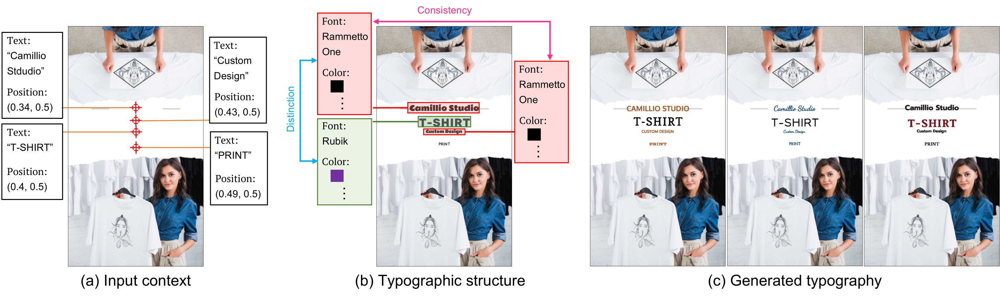

## Paper: Towards Diverse and Consistent Typography Generation
Wataru Shimoda<sup>1</sup>, Daichi Haraguchi<sup>2</sup>, Seiichi Uchida<sup>2</sup>, Kota Yamaguchi<sup>1</sup>  
<sup>1</sup>CyberAgent.Inc, <sup>2</sup> Kyushu University  
Accepted to WACV2024.
[[Publication](https://openaccess.thecvf.com/content/WACV2024/papers/Shimoda_Towards_Diverse_and_Consistent_Typography_Generation_WACV_2024_paper.pdf)]
[[Arxiv](https://arxiv.org/abs/2309.02099)]
[[Project-page](https://cyberagentailab.github.io/tdc-typography-generation/)]

## Introduction
This repository contains the codes for ["Towards Diverse and Consistent Typography Generation"](https://arxiv.org/abs/2309.02099).



## Requirements
We check the reproducibility under the environment.
- Ubuntu (>=20.04)
- Python3 (>=3.8, <3.11)


## Install
Clone this repository and navigate to the folder

``` sh
git clone https://github.com/CyberAgentAILab/tdc-typography-generation.git
cd tdc-typography-generation
```

We manage the dependencies of python libraries by [pyproject.toml](https://github.com/CyberAgentAILab/tdc-typography-generation/blob/main/pyproject.toml).  
Please install the dependencies via pip or poetry using [pyproject.toml](https://github.com/CyberAgentAILab/tdc-typography-generation/blob/main/pyproject.toml). 


If the version of setuptools is `setuptools >=61.0.0`, the following command installs the dependencies via pip:
``` sh
pip install .
```
or  
We recommend installing the dependencies using Poetry (see [official docs](https://python-poetry.org/docs/)):
``` sh
poetry install
```
Note that we omit the head of commands `poetry run` in the after guidance for simplification.

## Dataset
Our model is trained and tested on [Crello dataset](https://huggingface.co/datasets/cyberagent/crello), and this dataset is open on [Hugging Face](https://huggingface.co/).  
We can download this dataset through the [Hugging Face Dataset API](https://huggingface.co/docs/datasets/index), but this dataset does not contain high-resolution background images. 

We provide background images via Google Drive ([link](https://storage.googleapis.com/ailab-public/tdc_typography_generation/generate_bg_png.tar.gz), 3.6GB).  
Please download the background images and locate them to `data/generate_bg_png/`.  
``` sh
tar zxvf generate_bg_png.tar.gz 
mv generate_bg_png data/
rm generate_bg_png.tar.gz
```

We also provide font files for rendering designs and computing appropriate text sizes via Google Drive ([link](https://storage.googleapis.com/ailab-public/tdc_typography_generation/font.tar.gz), 43MB).  
Please download the font files and locate them to `data/font/`.  
``` sh
tar zxvf font.tar.gz 
mv font data/
rm font.tar.gz
```

## Usage
We prepare scripts for experiments as the following.

### Preprocessing
We recommend adding features to the dataset in advance, it makes training and testing faster.  
We provide a script for preprocessing:
``` sh
python -m typography_generation map_features --datadir data
```
This script extends the dataset via [map function](https://huggingface.co/docs/datasets/v2.15.0/en/package_reference/main_classes#datasets.Dataset.map).  
The extended dataset is saved in `data/map_featreus`, and `--use_extended_dataset` option manages the use of the extended dataset.

### Training
The following command trains a model, it takes a half day with the preprocessed dataset and a NVIDIA T4 machine.  
We handle the detail of training via configuration files in `data/config/*.yaml`.  
The basic configurations are in `src/typography_generation/config/*.py`.  

``` sh
python -m typography_generation train_evaluation \
          --configname bart \
          --jobdir ${OUTPUT_DIR} \
          --datadir data \
          --use_extended_dataset \
          --gpu \
```
The outputs are in `${OUTPUT_DIR}`.

### Sampling 
The following command samples typographic attributes.  
This command requires `--weight` option, which is a path for loading weights of a trained model.  
A weight file obtained by the avobe training command is in  `${OUTPUT_DIR}/weight.pth`.  
Please assign a path of a weight file to `${WEIGHT_FILE}`.
``` sh
python -m typography_generation structure_preserved_sample \
          --configname bart \
          --jobdir ${OUTPUT_DIR} \
          --datadir data \
          --weight=${WEIGHT_FILE} \
          --use_extended_dataset \
          --gpu \
```


## Visualization
We provides notebooks for showing results.  
- `notebooks/score.ipnyb` shows scores of the saved results in `${OUTPUT_DIR}`.  
- `notebooks/vis.ipnyb` shows generated graphic designs in `${OUTPUT_DIR}`.  

## Reference
```bibtex
@misc{shimoda_2024_tdctg,
    author    = {Shimoda, Wataru and Haraguchi, Daichi and Uchida, Seiichi and Yamaguchi, Kota},
    title     = {Towards Diverse and Consistent Typography Generation},
    publisher = {Winter Conference on Applications of Computer Vision (WACV)},
    year      = {2024},
}
```

## Contact
This repository is maintained by Wataru shimoda(wataru_shimoda[at]cyberagent.co.jp).
